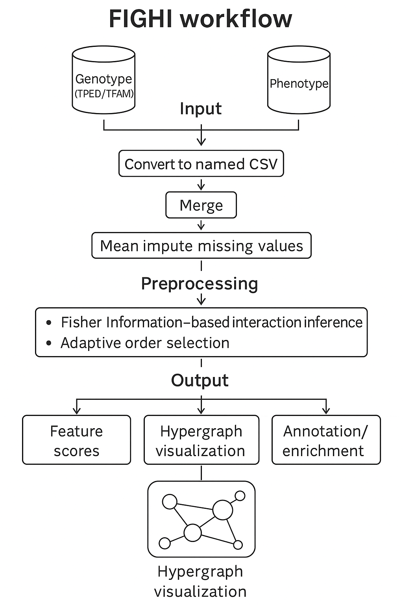
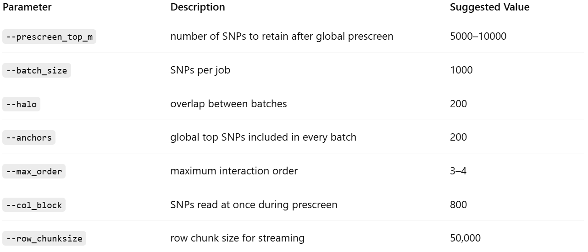
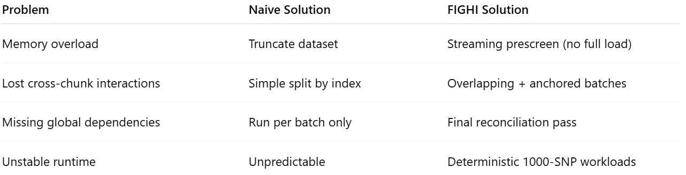

# FIGHI
FIGHI: Fisher-Information–Guided Hyper-interaction Inference for genome-wide epistasis discovery, summaries, and hypergraph outputs.

**FIGHI** is a fast, memory-aware method to discover **SNP–SNP (and higher-order) interactions** from genotype × phenotype data. It uses score-test approximations to **Fisher Information gain** to rank multi-locus combinations without fitting an enormous number of full models.

- **Goal:** find biologically meaningful epistasis and higher-order interactions
- **Fast & light:** vectorized score tests; memory-aware joins; chunked IO
- **Genomics-friendly IO:** TPED/TFAM/PLINK `.phen` → tidy CSV, rsIDs preserved
- **Network outputs:** Cytoscape/Gephi-ready hypergraphs
- **Annotation & enrichment:** optional SNP→gene mapping (cS2G/g:Profiler) & pathway/disease enrichment
- **HPC-friendly:** drop-in Slurm job (with disease tag), thread controls, no heavy dependencies

<p align="center">
  
</p>

---

## Why FIGHI?

Combinatorial interaction searches explode in cost. FIGHI sidesteps this by:
1. Screening variants (MAF-aware, standardized) to a feasible atom set.
2. Growing candidate tuples using an Apriori-style generator with variance pruning.
3. Ranking candidates via **score-test Fisher Information gain** (logistic/linear).
4. Adapting the maximum order `K` using information sufficiency and a power planner.
5. Emitting a **hypergraph** view and **SNP-level feature scores**, with optional annotation.

> TL;DR: You get interpretable interactions and network artifacts without OOMs.

---

## FIGHI Batching & Scalable Execution

Large-scale genomic feature interactions are computationally heavy — especially when scanning millions of SNPs for higher-order interactions.
The FIGHI framework implements an adaptive batching strategy that makes full-genome analysis feasible on HPC clusters (SLURM) without losing accuracy or cross-interaction signals.

### Motivation

Running FIGHI on all SNPs at once can exceed memory or wall-time limits.
Naively subsetting to 1000 SNPs avoids crashes but breaks biological interactions between SNPs split across subsets.

To solve this, we designed a “smart chunking” system that guarantees:

- Predictable memory & runtime per job.

- Retention of cross-chunk interactions.

- Accurate final results close to a monolithic full run.

### Conceptual Overview

The batching protocol consists of three major stages:

#### 1. Global Prescreen (Streaming)

FIGHI first streams through the entire genotype file (in chunks) and ranks SNPs by their marginal correlation with the phenotype.

This step identifies a candidate pool of the most informative SNPs (e.g., top 5,000) — without loading the entire dataset into memory.

Command example:

```bash
python fighi_ext/run_cli.py \
  --csv data/merged_genotype.csv \
  --pheno case \
  --outdir out/prescreen \
  --prescreen_top_m 5000 \
  --col_block 800 \
  --row_chunksize 50000 \
  --write_top_cols
```

Output:
```bash
out/prescreen/top_columns.txt   # ranked SNP list (used for batching)
```


#### 2. Overlapping Batches + Global Anchors

Instead of splitting the SNPs strictly into blocks of 1000, we use an overlapping and anchored batching scheme:

Parameter	Description
- B (batch_size)	number of SNPs per job (default: 1000)
- H (halo)	overlap between consecutive batches (default: 200)
- A (anchors)	top global SNPs repeated in every batch (default: 200)

This ensures that SNPs in different batches can still “see” each other through anchors and overlaps.

Command example:
```bash
python prep_batches.py \
  --top_cols out/prescreen/top_columns.txt \
  --batch_size 1000 \
  --halo 200 \
  --anchors 200 \
  --outdir out/batches
```

Outputs:

```bash
out/batches/batches.txt       # list of per-batch files
out/batches/batch_0001.cols   # SNP names for batch 1
out/batches/batch_0002.cols   # ...
```

#### 3. Distributed Execution (SLURM Array)

Each batch is processed independently on the cluster using an array job, where each task extracts only its assigned columns and runs FIGHI.

Submit command:
```bash
sbatch fighi_batch.slurm data/merged_genotype.csv case out/batches/batches.txt
```

Each task performs:

- Extract subset of SNPs + phenotype using subset_columns.py

- Run FIGHI pipeline (fighi_ext/run_cli.py)

- Save outputs in out/batches_out/batch_XXXX/

Example batch output:
```bash
out/batches_out/batch_0001/fighi_results.csv
out/batches_out/batch_0001/fighi_summary.json
...
```

#### 4. Reconciliation Pass (Final Merge)

After all batches complete, a final union pass merges discovered SNPs across batches and re-runs FIGHI only on that reduced set.

Steps:
```bash
python reconcile_collect_snps.py \
  --batches_out out/batches_out \
  --out_snplist out/reconcile_snps.txt

python subset_columns.py \
  --csv data/merged_genotype.csv \
  --pheno case \
  --cols_file out/reconcile_snps.txt \
  --out_csv out/reconcile.csv

python fighi_ext/run_cli.py \
  --csv out/reconcile.csv \
  --pheno case \
  --trait binary \
  --outdir out/final_union \
  --max_order 4
```

This final step ensures that no cross-batch interactions are lost.

#### Full Orchestration via SLURM

The entire process can be automated using the fighi_ext/fighi_orchestrate.slurm script:
```bash
sbatch fighi_orchestrate.slurm
```

It automatically performs:

- Global prescreen (top 5,000 SNPs)

- Batch creation (1000 SNPs per job + 200 overlap + 200 anchors)

- SLURM array submission

- Dependency-based reconciliation (runs after all array jobs finish)

Outputs:
```bash
out/
├─ prescreen/
├─ batches/
├─ batches_out/
├─ reconcile_snps.txt
├─ reconcile.csv
└─ final_union/
```

#### Recommended Parameter Settings

<p align="center">
  
</p>

Adjust these based on dataset size and cluster memory (e.g., 120–180 GB RAM per job).

#### Why It Works

<p align="center">
  
</p>

This architecture ensures:

- Biological fidelity (interactions preserved)

- Computational scalability (bounded memory)

- Easy SLURM orchestration (one command to launch)

### Optional Refinements

- LD-aware batching: Replace prep_batches.py with an LD block–aware version using PLINK clumps or 1 cM windows.

- MAF & missingness filtering: Pre-filter rare SNPs to improve stability.

- Chromosome-level isolation: Run FIGHI per chromosome before union reconciliation.

#### Example Quickstart Summary

##### Step 1: Prescreen
```bash
python fighi_ext/run_cli.py --csv data/CD.csv --pheno case --outdir out/prescreen \
  --prescreen_top_m 5000 --write_top_cols
```
##### Step 2: Create batches
```bash
python prep_batches.py --top_cols out/prescreen/top_columns.txt --batch_size 1000 \
  --halo 200 --anchors 200 --outdir out/batches
```

##### Step 3: Submit array
```bash
sbatch --array=1-$(wc -l < out/batches/batches.txt) fighi_batch.slurm \
  data/CD.csv case out out/batches/batches.txt
```
##### Step 4: Final reconcile
```bash
sbatch reconcile_run.slurm data/CD.csv case out
```

or simply:
```bash
sbatch fighi_orchestrate.slurm
```

#### Folder Structure Recap

```bash
fighi/
├─ fighi_ext/                     # Python package + scripts
│  ├─ __init__.py
│  ├─ adaptive.py
│  ├─ apriori.py
│  ├─ fisher.py
│  ├─ glm.py
│  ├─ hypergraph.py
│  ├─ knockoff_perm.py
│  ├─ pipeline.py
│  ├─ report.py
│  ├─ run_cli.py                  # can run as `python -m fighi_ext.run_cli` or `python fighi_ext/run_cli.py`
│  ├─ tped_to_named_csv.py
│  ├─ merge_pheno_geno_nopandas.py
│  ├─ annotate_fighi_features.py
│  └─ utils.py
|  ├─ prep_batches.py             # batch generator
|  ├─ subset_columns.py           # extracts subset of columns + phenotype
|  ├─ reconcile_collect_snps.py   # merges discovered SNPs across batches
|  ├─ fighi_batch.slurm           # SLURM array job (per batch)
|  ├─ reconcile_run.slurm         # SLURM final union pass
|  ├─ fighi_orchestrate.slurm     # complete orchestrator (recommended)
├─ examples/
│  └─ (tiny toy data / minimal commands)
├─ docs/
│  ├─ README_theory.md            # full math/theory (we drafted earlier)
│  └─ assets/
│     ├─ fighi_protocol.png       # flowchart
│     └─ fighi_cover.png          # cover art
├─ fighi_job.slurm                # SLURM job (disease-var enabled)
├─ README.md                      # user-facing quickstart
├─ LICENSE                        # MIT (if chosen)
└─ .gitignore
```


## Naive Run (with less data features); Install

### Option A: local (recommended while developing)
```bash
git clone https://github.com/1234-Ariel-code/FIGHI.git
cd FIGHI
# (optional) conda
conda env create -f environment.yml
conda activate fighi
# ensure parent of fighi_ext/ is visible
export PYTHONPATH="$(pwd):${PYTHONPATH:-}"
```


## Option B: editable install (lets you call python -m fighi_ext.run_cli)
```bash
pip install -e .
```

## Quick start 
(see [docs/QUICKSTART.md](docs/QUICKSTART.md))

Minimal end-to-end on a merged CSV with phenotype column:

```bash
# ensure repo root on PYTHONPATH if running scripts in-place
export PYTHONPATH="$(pwd):${PYTHONPATH:-}"

python fighi_ext/run_cli.py \
  --csv path/to/merged.csv \
  --pheno case \
  --trait binary \
  --outdir fighi_ext/fighi_out \
  --max_order 4
```

From TPED/TFAM + PLINK .phen:

```bash
# 1) TPED → named numeric matrix (rsID columns, IID preserved)
python fighi_ext/tped_to_named_csv.py \
  --tped data/CD_origin.tped --tfam data/CD_origin.tfam \
  --phen_file data/CD_origin.phen \
  --out_csv data/CD_filtered_named.csv

# 2) Merge with phenotype (pandas-free, memory-lean)
python fighi_ext/merge_pheno_geno_nopandas.py \
  --geno_csv data/CD_filtered_named.csv \
  --phen_file data/CD_origin.phen \
  --out_csv data/CD_merged.csv \
  --phen_name case --impute_mean

# 3) Run FIGHI
python fighi_ext/run_cli.py \
  --csv data/CD_merged.csv --pheno case \
  --trait binary --outdir fighi_ext/fighi_out \
  --max_order 4
```

## Outputs (in fighi_ext/fighi_out/ by default):

- fighi_results.csv — interaction rows with order, fi_gain, beta_hat, info

- fighi_feature_scores.csv — per-SNP FI main/interaction totals (+ optional Gene/Pathway)

- fighi_hypergraph.gml, fighi_cytoscape.cyjs, fighi_hypergraph.hyper

- fighi_summary.json, fighi_model.pkl, fighi_log.txt

- plots/ — FI gain distribution, interaction heatmap, FI vs order, convergence traces


## Slurm (HPC)

A ready job is in fighi_ext/fighi_job.slurm It supports a single disease tag used everywhere, saves outputs in fighi_ext/fighi_out, and exports thread envs. See [docs/ALGORITHM.md](docs/ALGORITHM.md) for the complete script and notes.

## Method in 30 seconds

- Score-test FI gain (logistic/linear) estimates the information contributed by a new product feature (tuple of SNPs) without full refits.

- Apriori-style candidate growth + variance/MAF pruning keep the search sparse.

- Information ratio and planner stop at a sensible max order K under power constraints.

- Optional Westfall–Young controls family-wise error for permutations.

- Full derivations and references: [docs/THEORY.md](docs/THEORY.md).

## Cite

If you use FIGHI, please cite us (see also CITATION.cff):

```bash
@article{fighi2025,
  title={FIGHI: Fisher-Information–Guided Hyperinteraction Inference for Epistasis Discovery},
  author={Ariel G. Kemogne K. et al},
  journal={bioRxiv},
  year={2025},
  doi={10.1101/xxxxx}
}
```

## License

MIT (see LICENSE).

## Contributing

Issues and PRs welcome! Please see [docs/CONTRIBUTING.md](docs/CONTRIBUTING.md) & [docs/CODE_OF_CONDUCT.md](docs/CODE_OF_CONDUCT.md).


For full derivations and equations, see [docs/THEORY.md](docs/THEORY.md)


<p align="center">
  
</p>

