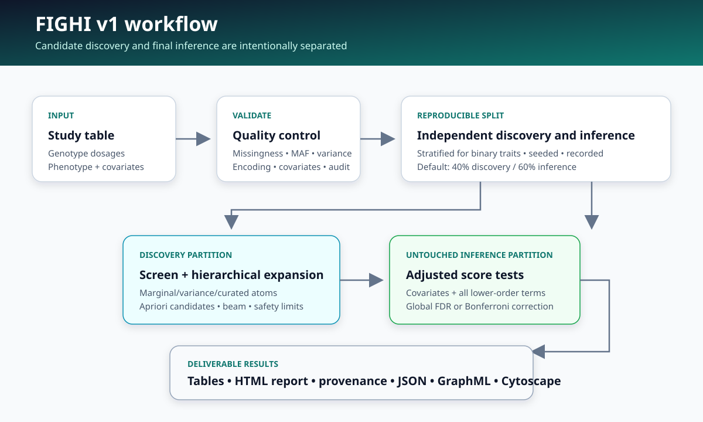

# FIGHI

**Fisher-Information-Guided Hyperinteraction Inference** for reproducible discovery of pairwise and higher-order feature interactions.

FIGHI screens candidate genomic features, builds interaction candidates hierarchically, ranks them by Fisher-information gain, and tests the highest-order interaction term while adjusting for covariates and all lower-order terms within the candidate. By default, candidate discovery and final inference use independent sample partitions.



## What the v1.1 release provides

- A real installable Python package and `fighi` command.
- Independent discovery/inference splitting by default.
- Correct interaction null models containing an intercept, covariates, and lower-order terms.
- Score-test p-values plus global Benjamini-Hochberg or Bonferroni adjustment.
- Binary and continuous traits, categorical or numeric covariates, missingness and MAF QC.
- Safe candidate-count limits and explicit exploratory mode.
- CSV/TSV input, TPED/TFAM conversion, local SNP-to-gene mapping, and GMT enrichment.
- CSV, JSON, HTML, GML, GraphML, Cytoscape, edge-list, provenance, and diagnostic outputs.
- PLINK 2 BED/PGEN/VCF preparation for curated candidate sets with allele convention, logs and hashes.
- Truth-known binary/continuous simulations spanning null, main, interaction, LD and structure settings.
- A safe manifest runner for FIGHI, PLINK, MDR/GMDR, BOOST, BEAM and generic comparators.
- Harmonized p-value correction, truth recovery, top-result overlap, time, CPU and memory summaries.
- Reproducible demo, Python API, automated tests, CI, Docker, Apptainer, ARC/Slurm scripts, and complete documentation.

## Install

Python 3.10 or newer is required.

```bash
git clone https://github.com/1234-Ariel-code/fighi.git
cd fighi
python -m venv .venv
source .venv/bin/activate       # Windows: .venv\Scripts\activate
python -m pip install --upgrade pip
python -m pip install .
```

For development:

```bash
python -m pip install -e ".[dev]"
```

After a PyPI release, installation becomes `python -m pip install fighi`.

## Verify the installation

```bash
fighi --version
fighi demo --outdir fighi_demo
```

The demo plants an interaction between `rs_demo_03` and `rs_demo_07`, runs the complete analysis, and creates `fighi_demo/analysis/fighi_report.html`.

## Run on your data

```bash
fighi validate cohort.csv \
  --phenotype case \
  --id-column IID \
  --covariates age,sex,PC1,PC2

fighi run cohort.csv \
  --phenotype case \
  --id-column IID \
  --covariates age,sex,PC1,PC2 \
  --trait binary \
  --top-m 100 \
  --max-order 2 \
  --outdir results
```

Input is sample-by-column CSV or TSV. Candidate genotype columns must be numeric dosages in `[0, 2]`; missing values are mean-imputed after missingness filtering. Binary phenotypes may use `0/1`, PLINK-style `1/2`, or two other levels. Continuous phenotypes must be numeric.

For a curated candidate set, place one feature name per line in a text file and add `--feature-file candidates.txt`. This is preferable to aggressive outcome-driven screening when prior biological knowledge is available.

## Prepare BED/PGEN/VCF data

`prepare-plink` invokes a separately installed PLINK 2 executable, exports only a pre-specified candidate set, merges an IID-keyed phenotype/covariate table, and writes a compressed sample-major table plus exact command, logs, retained samples/variants and SHA-256 provenance.

```bash
fighi prepare-plink \
  --input /secure/cohort/qc/cohort \
  --input-type pgen \
  --candidates design/candidates.txt \
  --samples design/keep.txt \
  --phenotype-file /secure/cohort/phenotypes.tsv \
  --phenotype-column case \
  --covariates age,sex,PC1,PC2,PC3,PC4 \
  --threads 8 \
  --outdir work/prepared
```

Prepared dosages count alternate alleles because the wrapper uses PLINK 2 `--export A include-alt`. This workflow is for curated or already filtered variants, not a dense genome-wide text export. See the [real-data protocol](docs/REAL_DATA_PROTOCOL.md).

## Simulate and compare methods

```bash
fighi simulate \
  --outdir work/pairwise_seed17 \
  --samples 1000 \
  --features 100 \
  --scenario pairwise \
  --ld-rho 0.2 \
  --seed 17

fighi benchmark-template --output work/pairwise_seed17/benchmark.json
fighi benchmark-validate work/pairwise_seed17/benchmark.json
fighi benchmark-run work/pairwise_seed17/benchmark.json \
  --outdir work/pairwise_seed17/comparison \
  --strict
```

The generated manifest enables FIGHI and includes disabled PLINK and generic comparator adapters. Enable a comparator only after installing it separately and verifying its exact non-interactive command and output schema. FIGHI never invents p-values for ranking-only tools. Read [Benchmarking](docs/BENCHMARKING.md) for MDR/GMDR, PLINK, BOOST, BEAM, pathway-aware and information-theoretic comparison rules.

## Statistical modes

The default `--discovery-fraction 0.40` uses 40% of samples for feature screening and hierarchical candidate construction, then uses the untouched 60% for final score tests and multiplicity correction. Binary splits are stratified.

Set `--discovery-fraction 0` only for an explicitly exploratory analysis. All samples are then reused, increasing power but invalidating confirmatory interpretation after outcome-driven screening. FIGHI records this choice in the summary and report.

Each tested order-$K$ interaction includes all within-candidate terms of orders `1` through `K-1` in its nuisance model. This prevents a strong marginal effect from being reported as an interaction merely because it appears in a product feature. Binary-trait odds ratios are on the standardized product-feature scale, not the original per-allele scale.

## Important options

| Option | Default | Purpose |
|---|---:|---|
| `--max-order` | `2` | Highest interaction order, from 2 through 6 |
| `--top-m` | `50` | Features retained by screening |
| `--screen-method` | `hybrid` | `hybrid`, `marginal`, `variance`, or `all` |
| `--discovery-fraction` | `0.40` | Independent fraction for candidate discovery; `0` is exploratory |
| `--correction` | `fdr_bh` | `fdr_bh`, `bonferroni`, or `none` |
| `--alpha` | `0.05` | Adjusted-p-value threshold |
| `--beam-width` | `100` | Maximum parents used for higher-order expansion |
| `--max-candidates-per-order` | `100000` | Safety limit before costly evaluation begins |
| `--stability-repeats` | `0` | Optional conditional subsampling stability checks |
| `--min-maf` | `0.01` | Minor allele frequency filter |
| `--max-missing` | `0.10` | Maximum per-feature missing fraction |

## Outputs

| File | Contents |
|---|---|
| `fighi_results.csv` | Every evaluated inference candidate, test statistic, FI gain, p-value, adjusted p-value, effect estimate, and diagnostics |
| `fighi_significant_interactions.csv` | Multiplicity-controlled discoveries only |
| `fighi_feature_scores.csv` | Per-feature interaction counts and FI contributions |
| `fighi_summary.json` | Configuration, QC, split sizes, warnings, runtime, and counts |
| `fighi_model.json` | Portable result manifest; JSON replaces unsafe pickle serialization |
| `fighi_provenance.json` | Command, software version, Python, platform, and timestamp |
| `fighi_report.html` | Standalone human-readable report |
| `fighi_hypergraph.*` | JSON, GML, GraphML, and tabular hypergraph representations |
| `fighi_cytoscape.cyjs` | Cytoscape-compatible network elements |
| `plots/` | Evidence, interaction ranking, and FI-gain diagnostics |

An empty significant-interaction file and empty hypergraph are valid null results. FIGHI does not promote nonsignificant top-ranked candidates into discoveries.

Benchmark runs additionally create `benchmark_runs.csv`, `benchmark_interactions.csv`, `benchmark_method_summary.csv`, `benchmark_overlap.csv`, `benchmark_summary.json`, plots, logs, resource records and a standalone HTML report.

## TPED/TFAM conversion

```bash
fighi convert-tped \
  --tped cohort.tped \
  --tfam cohort.tfam \
  --phenotype-file cohort.phen \
  --phenotype-name case \
  --output cohort.csv
```

The converter uses a disk-backed matrix, validates sample/variant counts, preserves rsIDs, encodes major-allele dosages, and retains missing genotypes for later QC and imputation.

## Gene annotation and pathway enrichment

```bash
fighi annotate \
  --feature-scores results/fighi_feature_scores.csv \
  --snp-gene-map resources/snp_gene_map.tsv \
  --gmt resources/reactome.gmt \
  --outdir results/annotation
```

The mapping file needs feature/SNP/rsID and gene/symbol columns. Enrichment uses significant-interaction genes as the query and the supplied mapping intersected with the GMT database as the background. No package is installed at runtime and no data are silently sent to an external service.

## Python API

```python
import pandas as pd
from fighi import AnalysisConfig, FIGHI

data = pd.read_csv("cohort.csv")
model = FIGHI(AnalysisConfig(trait="binary", max_order=2, top_m=50))
result = model.fit(
    data.drop(columns=["case", "IID"]),
    data["case"],
)
print(result.to_frame().head())
```

## Interpretation boundaries

- FI gain ranks evidence; it is not a significance threshold.
- Holdout inference protects final tests from outcome-driven candidate discovery, but an independent cohort remains the best replication.
- Population structure, relatedness, ancestry, batch effects, LD, and environmental covariates must be handled in the study design and covariate set.
- Screening can miss pure epistasis with little marginal or variance signal. Use curated features or `--screen-method all` for manageable candidate sets.
- High-order interactions are combinatorial and require substantially larger samples. The default remains pairwise.
- FIGHI is research software, not a clinical diagnostic system.

Read [Methods](docs/METHODS.md), [Inputs and outputs](docs/INPUTS_OUTPUTS.md), [Scaling](docs/SCALING.md), [Limitations](docs/LIMITATIONS.md), [Real-data protocol](docs/REAL_DATA_PROTOCOL.md), and [Benchmarking](docs/BENCHMARKING.md) before a substantive analysis. Cluster users can start with the [ARC/Slurm quick start](docs/ARC_QUICKSTART.md).

## Development and release

```bash
python -m unittest discover -s tests -v
./scripts/verify_release.sh
python -m build
python -m twine check dist/*
```

See [Contributing](CONTRIBUTING.md), [Security](SECURITY.md), and the [release checklist](docs/RELEASING.md).

## Citation and license

Citation metadata are in [CITATION.cff](CITATION.cff). FIGHI is released under the MIT License.
